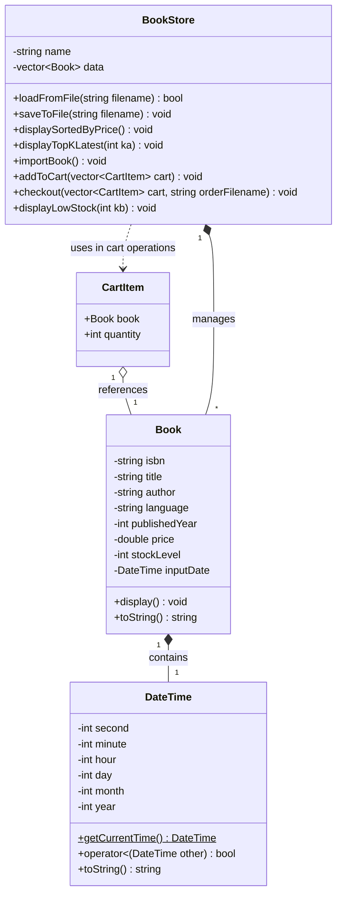

```mermaid
classDiagram
    class DateTime {
        -int second
        -int minute
        -int hour
        -int day
        -int month
        -int year
        +getCurrentTime() DateTime$
        +operator<(DateTime other) bool
        +toString() string
    }

    class Book {
        -string isbn
        -string title
        -string author
        -string language
        -int publishedYear
        -double price
        -int stockLevel
        -DateTime inputDate
        +display() void
        +toString() string
    }

    class CartItem {
        +Book book
        +int quantity
    }

    class BookStore {
        -string name
        -vector~Book~ data
        +loadFromFile(string filename) bool
        +saveToFile(string filename) void
        +displaySortedByPrice() void
        +displayTopKLatest(int ka) void
        +importBook() void
        +addToCart(vector~CartItem~ cart) void
        +checkout(vector~CartItem~ cart, string orderFilename) void
        +displayLowStock(int kb) void
    }

    %% Relationships
    Book "1" *-- "1" DateTime : contains
    CartItem "1" o-- "1" Book : references
    BookStore "1" *-- "*" Book : manages
    BookStore ..> CartItem : uses in cart operations
```