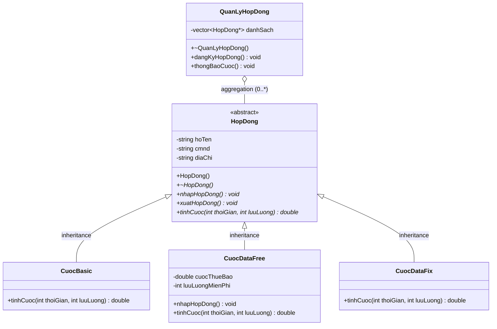

```mermaid
classDiagram
    class HopDong {
        <<abstract>>
        -string hoTen
        -string cmnd
        -string diaChi
        +HopDong()
        +~HopDong()*
        +nhapHopDong()* void
        +xuatHopDong()* void
        +tinhCuoc(int thoiGian, int luuLuong)* double
    }

    class CuocBasic {
        +tinhCuoc(int thoiGian, int luuLuong) double
    }

    class CuocDataFree {
        -double cuocThueBao
        -int luuLuongMienPhi
        +nhapHopDong() void
        +tinhCuoc(int thoiGian, int luuLuong) double
    }

    class CuocDataFix {
        +tinhCuoc(int thoiGian, int luuLuong) double
    }

    class QuanLyHopDong {
        -vector~HopDong*~ danhSach
        +~QuanLyHopDong()
        +dangKyHopDong() void
        +thongBaoCuoc() void
    }

    %% Mối quan hệ giữa các lớp
    HopDong <|-- CuocBasic : inheritance
    HopDong <|-- CuocDataFree : inheritance
    HopDong <|-- CuocDataFix : inheritance
    QuanLyHopDong o-- HopDong : aggregation (0..*)
```