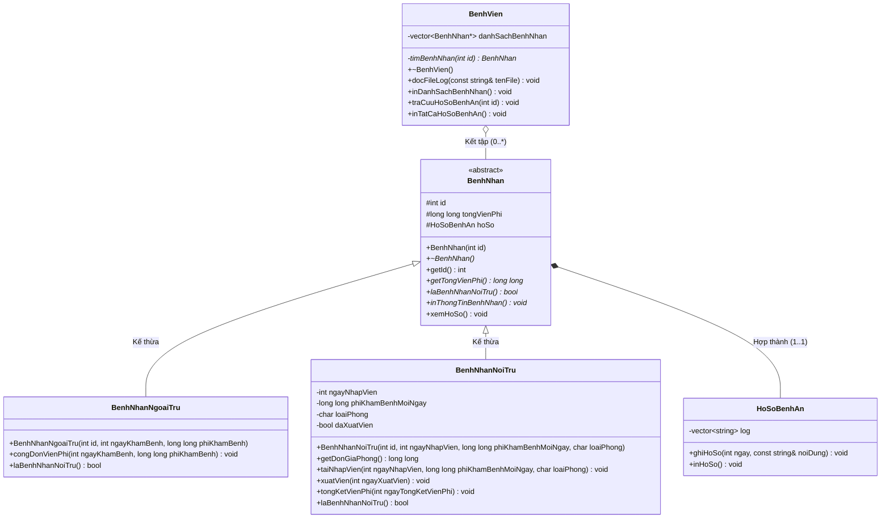

```mermaid
classDiagram
    class HoSoBenhAn {
        -vector~string~ log
        +ghiHoSo(int ngay, const string& noiDung) void
        +inHoSo() void
    }

    class BenhNhan {
        <<abstract>>
        #int id
        #long long tongVienPhi
        #HoSoBenhAn hoSo
        +BenhNhan(int id)
        +~BenhNhan()*
        +getId() int
        +getTongVienPhi()* long long
        +laBenhNhanNoiTru()* bool
        +inThongTinBenhNhan()* void
        +xemHoSo() void
    }

    class BenhNhanNgoaiTru {
        +BenhNhanNgoaiTru(int id, int ngayKhamBenh, long long phiKhamBenh)
        +congDonVienPhi(int ngayKhamBenh, long long phiKhamBenh) void
        +laBenhNhanNoiTru() bool
    }

    class BenhNhanNoiTru {
        -int ngayNhapVien
        -long long phiKhamBenhMoiNgay
        -char loaiPhong
        -bool daXuatVien
        +BenhNhanNoiTru(int id, int ngayNhapVien, long long phiKhamBenhMoiNgay, char loaiPhong)
        +getDonGiaPhong() long long
        +taiNhapVien(int ngayNhapVien, long long phiKhamBenhMoiNgay, char loaiPhong) void
        +xuatVien(int ngayXuatVien) void
        +tongKetVienPhi(int ngayTongKetVienPhi) void
        +laBenhNhanNoiTru() bool
    }

    class BenhVien {
        -vector~BenhNhan*~ danhSachBenhNhan
        -timBenhNhan(int id) BenhNhan*
        +~BenhVien()
        +docFileLog(const string& tenFile) void
        +inDanhSachBenhNhan() void
        +traCuuHoSoBenhAn(int id) void
        +inTatCaHoSoBenhAn() void
    }

    %% Mối quan hệ giữa các lớp
    BenhNhan <|-- BenhNhanNgoaiTru : Kế thừa
    BenhNhan <|-- BenhNhanNoiTru : Kế thừa
    BenhNhan *-- HoSoBenhAn : Hợp thành (1..1)
    BenhVien o-- BenhNhan : Kết tập (0..*)
```