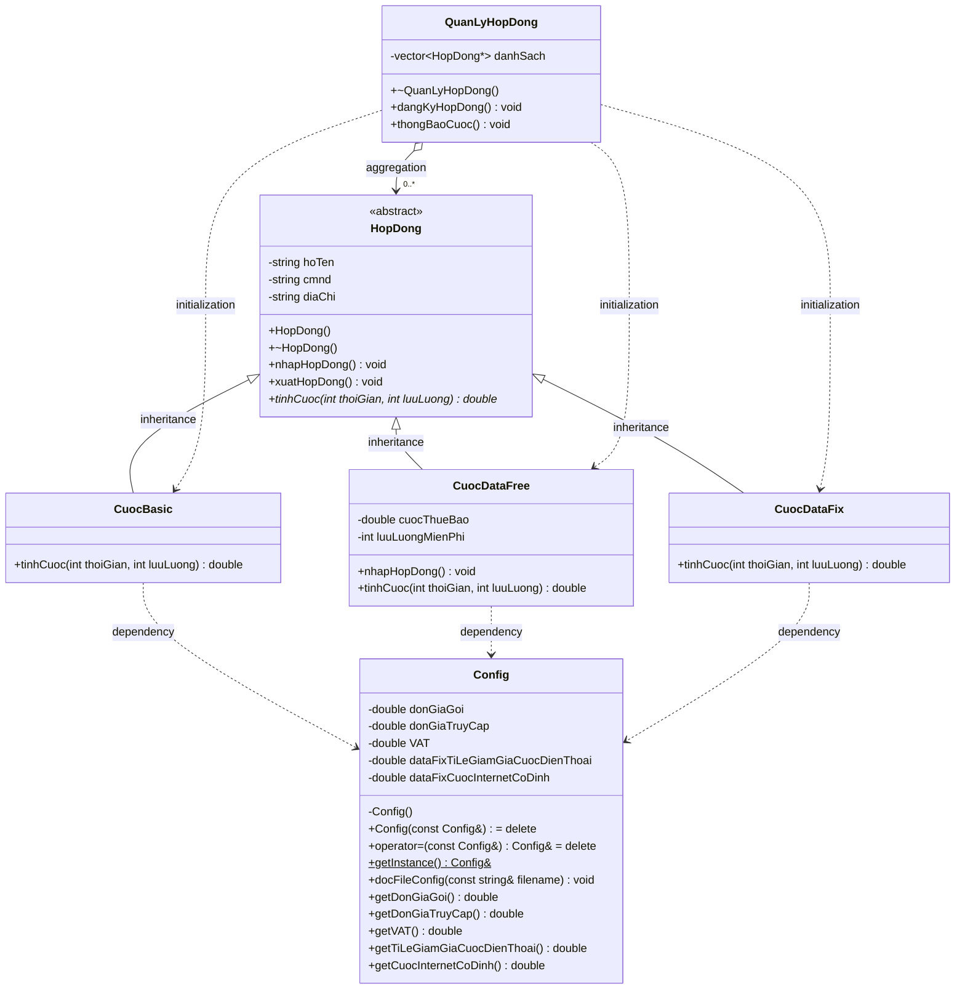

```mermaid
classDiagram
    class Config {
        -double donGiaGoi
        -double donGiaTruyCap
        -double VAT
        -double dataFixTiLeGiamGiaCuocDienThoai
        -double dataFixCuocInternetCoDinh
        -Config()
        +Config(const Config&) = delete
        +operator=(const Config&) Config& = delete
        +getInstance()$ Config&
        +docFileConfig(const string& filename) void
        +getDonGiaGoi() double
        +getDonGiaTruyCap() double
        +getVAT() double
        +getTiLeGiamGiaCuocDienThoai() double
        +getCuocInternetCoDinh() double
    }

    class HopDong {
        <<abstract>>
        -string hoTen
        -string cmnd
        -string diaChi
        +HopDong()
        +~HopDong()
        +nhapHopDong() void
        +xuatHopDong() void
        +tinhCuoc(int thoiGian, int luuLuong)* double
    }

    class CuocBasic {
        +tinhCuoc(int thoiGian, int luuLuong) double
    }

    class CuocDataFree {
        -double cuocThueBao
        -int luuLuongMienPhi
        +nhapHopDong() void
        +tinhCuoc(int thoiGian, int luuLuong) double
    }

    class CuocDataFix {
        +tinhCuoc(int thoiGian, int luuLuong) double
    }

    class QuanLyHopDong {
        -vector~HopDong*~ danhSach
        +~QuanLyHopDong()
        +dangKyHopDong() void
        +thongBaoCuoc() void
    }

    HopDong <|-- CuocBasic : inheritance
    HopDong <|-- CuocDataFree : inheritance
    HopDong <|-- CuocDataFix : inheritance

    QuanLyHopDong o--> "0..*" HopDong : aggregation
    QuanLyHopDong ..> CuocBasic : initialization
    QuanLyHopDong ..> CuocDataFree : initialization
    QuanLyHopDong ..> CuocDataFix : initialization

    CuocBasic ..> Config : dependency
    CuocDataFree ..> Config : dependency
    CuocDataFix ..> Config : dependency
```