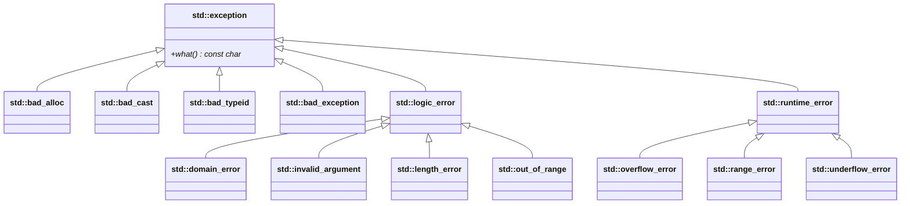

```mermaid
classDiagram

    class `std::exception` {
        +what() const char*
    }

    %% Nhóm kế thừa trực tiếp từ std::exception.
    `std::exception` <|-- `std::bad_alloc`
    `std::exception` <|-- `std::bad_cast`
    `std::exception` <|-- `std::bad_typeid`
    `std::exception` <|-- `std::bad_exception`
    `std::exception` <|-- `std::logic_error`
    `std::exception` <|-- `std::runtime_error`

    %% Nhóm kế thừa từ std::logic_error.
    `std::logic_error` <|-- `std::domain_error`
    `std::logic_error` <|-- `std::invalid_argument`
    `std::logic_error` <|-- `std::length_error`
    `std::logic_error` <|-- `std::out_of_range`

    %% Nhóm kế thừa từ std::runtime_error.
    `std::runtime_error` <|-- `std::overflow_error`
    `std::runtime_error` <|-- `std::range_error`
    `std::runtime_error` <|-- `std::underflow_error`
```